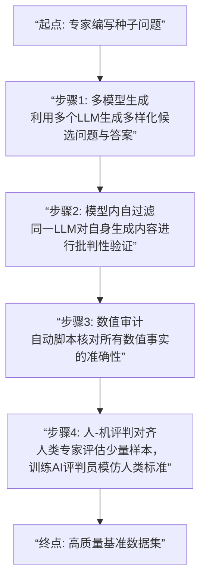

## 论文信息

**标题**: FinTradeBench: A Financial Reasoning Benchmark for LLMs

**作者**: Yogesh Agrawal, Aniruddha Dutta, Md Mahadi Hasan, et al.

**发布日期**: 2026-03-19

**arXiv ID**: [2603.19225v1](https://arxiv.org/abs/2603.19225v1)

**PDF链接**: [下载PDF](https://arxiv.org/pdf/2603.19225v1)

## 论文背景与研究动机：金融决策的“双轨”挑战与LLM评估的缺失

在现实世界的金融决策中，分析师面临着“双轨”信息的融合难题。一方面，是源自公司财报、监管文件等文本的**基本面信息**，它描绘了公司的内在价值、经营健康状况和长期前景。另一方面，是源自市场交易行为、价格波动的**交易信号**，它反映了市场情绪、资金流向和短期供需关系。一个成功的投资决策，往往需要对这两类异质信号进行综合推理，理解它们之间的动态交互。例如，一家公司财报亮眼（基本面强），但其股价却持续下跌（交易信号弱），这背后可能隐藏着市场尚未充分认知的风险，或是行业周期的转折点。

近年来，随着大语言模型在文本理解、逻辑推理方面展现出惊人能力，金融从业者开始尝试将其应用于投资研究、报告生成和决策支持。然而，现有的用于评估LLM金融能力的基准测试，如FinQA、ConvFinQA等，大多聚焦于从财务报表中提取和计算数值（如利润率、负债率），本质上是对**结构化数字的文本化问答**。它们严重缺失了对市场交易行为、技术指标、时间序列模式等“交易信号”的推理评估，更遑论要求模型将基本面与交易信号进行交叉分析和综合判断。

这种评估的片面性带来了巨大风险：一个在现有基准上表现优异的LLM，可能只是一个优秀的“财报阅读器”，却对市场动态一窍不通，将其直接用于真实投资决策可能导致灾难性后果。因此，构建一个同时涵盖公司基本面与市场交易信号的综合性金融推理基准，已成为推动LLM在金融领域安全、可靠应用的关键前提。这正是FinTradeBench诞生的核心动机——为LLM的金融智能提供一个更接近真实世界的“试金石”。

## 核心方法与技术细节：构建可靠基准的“校准-扩展”框架

FinTradeBench的构建不仅追求内容的全面性，更致力于在规模化生产中保证问题的**高质量、高可靠性和低偏差**。为此，论文创新性地采用了一套严谨的“校准-扩展”框架。

**基准内容构成**
基准包含1,400道问题，全部基于纳斯达克100指数成分股在过去十年（2013-2023）的历史数据。问题被精心设计为三大推理类别：
*   **基本面类**：问题完全基于公司财报、业务描述等文本信息。例如，“根据苹果公司2022财年的10-K文件，其研发支出占营收的比例是多少？”
*   **交易信号类**：问题完全基于股价、成交量、衍生品数据等市场信息。例如，“在2020年3月市场波动期间，微软股票的20日历史波动率峰值是多少？”
*   **混合类**：问题需要交叉推理基本面与交易信号。这是最具挑战性的一类，例如，“特斯拉在2021年发布超预期交付数据（基本面）的当天，其股价的异常收益率和成交量放大情况如何？这反映了市场对该信息的反应是积极、消极还是存在分歧？”

**“校准-扩展”框架详解**
这是论文方法论的精华，其流程如下图所示，共分五个步骤：

1.  **专家种子校准**：由金融领域专家手工编写一小部分（种子）问题及答案，确立质量标准和问题风格。
2.  **多模型响应生成**：利用多个先进的LLM（如GPT-4、Claude等），以种子问题为引导，生成大量新的候选问题和答案。这一步旨在利用LLM的创造力进行规模化扩展，同时通过模型多样性减少单一模型的偏见。
3.  **模型内自过滤**：这是一个关键的质量控制步骤。让生成候选问题的LLM**自己**对其生成的问题和答案进行批判性评估（例如，询问“你刚才生成的这个问题是否存在事实错误或逻辑矛盾？”）。通过这种“自我批评”机制，可以过滤掉大量不一致、模糊或错误的内容。
4.  **数值审计**：对于涉及具体数值（如股价、财务比率）的问题，运行独立的自动化脚本，直接从可靠数据源（如雅虎财经、SEC EDGAR数据库）查询验证，确保每一个数字都准确无误。
5.  **人-机评判对齐**：最后，邀请人类专家对一部分经过上述过滤的问题进行最终评判。然后，利用这部分“人类标注”的数据来微调一个AI评判模型，使其评分标准与人类专家对齐。此后，这个AI评判员可以高效、一致地评估剩余大量问题的质量。

这套组合拳确保了FinTradeBench既具备可扩展性，又维持了专家级的数据质量，为后续的模型评估奠定了可信的基础。

## 创新点与贡献：填补关键空白，定义评估新范式

FinTradeBench的核心贡献是多维度的：

1.  **首个融合基本面与交易信号的金融推理基准**：它突破了现有基准仅关注财报数字的局限，首次系统性地将市场微观结构、技术分析等交易信号纳入LLM评估体系，并开创性地设置了需要**交叉推理**的混合类问题，极大地提升了评估任务与现实金融决策的贴合度。
2.  **提出并验证了可靠的“校准-扩展”基准构建框架**：该框架将专家知识、多模型协作、自指式过滤、自动化验证和人机协同有机结合，为未来构建其他高质量、低噪声的专业领域评测基准提供了可复用的方法论模板。
3.  **揭示了LLM在金融推理中的关键能力缺陷**：通过系统的实验，论文不仅给出了模型排名，更深入剖析了失败原因，特别是明确了LLM在**数值推理**和**时间序列推理**方面的固有短板（下文详述），为后续研究指明了精准的改进方向。

## 实验结果分析：检索增强的“喜”与“忧”，及LLM的能力边界

论文评估了包括GPT-4、Claude、Llama等在内的14个主流LLM，并在零样本提示和检索增强生成两种设置下进行测试。

**核心发现一：检索增强的效果因信息类型而异**
*   **对基本面类问题效果显著**：当为LLM提供相关的财报文本片段作为上下文时，其回答准确性大幅提升。这是因为基本面信息本质是**文本描述的数字**，检索能直接提供解题所需的“原材料”。
*   **对交易信号类问题帮助有限**：即使为模型提供了股价时间序列数据或技术指标计算结果，其性能改善微乎其微。这暴露了LLM的核心弱点：它们擅长处理语言和符号逻辑，但缺乏对**纯数值序列**进行数学运算、识别模式（如趋势、波动率突变）、进行跨时间点比较的内在能力。给LLM一堆数字，就像给一个语言学家一堆没有语法的单词，他很难说出有意义的话。

**核心发现二：混合类问题难度最高，性能鸿沟明显**
在所有类别中，需要结合文本基本面与数值交易信号进行推理的混合问题，对所有模型都是最难的。表现最好的GPT-4在该类目下的准确率也远低于其他两类。这清晰地表明，当前LLM尚不具备熟练的**多模态信息融合推理**能力，无法像人类分析师那样，将“公司故事”与“市场图表”流畅地关联起来。

**核心发现三：规模并非万能，架构与训练数据至关重要**
实验结果并未显示模型性能与参数规模存在简单线性关系。一些参数更少的模型，可能因为在其预训练或微调数据中包含了更多高质量的金融或数学推理数据，从而表现优于更大的通用模型。这提示，领域特定的能力更依赖于**高质量的专业数据**和**针对性的模型架构设计**。

## 实践应用建议与未来发展方向

**对量化交易与金融科技从业者的建议：**
1.  **谨慎评估与场景适配**：在引入LLM辅助决策前，应使用类似FinTradeBench的综合性基准评估其能力边界。避免让LLM独立处理纯数值推理或需要深度市场感知的任务。更适合的应用场景是：基于长篇财报、新闻、电话会议记录进行信息摘要、风险点提取、情感分析（基本面文本处理），或将复杂的交易逻辑、风控规则转化为自然语言描述。
2.  **构建“LLM + 传统模型”的混合系统**：发挥LLM的文本理解优势和传统量化模型（如统计模型、时间序列模型）的数值计算优势。例如，用传统模型生成交易信号和预测，用LLM来解释这些信号背后的基本面原因、撰写投资逻辑报告，或根据市场突发新闻动态调整策略参数。
3.  **注重高质量金融语料库建设**：企业若想微调自己的金融大模型，必须投入资源构建包含财报、研报、市场评论、以及**结构化数值数据与文本关联**的大规模高质量数据集。

**对未来研究方向的展望：**
1.  **增强LLM的数值与时间序列处理能力**：这是最紧迫的方向。研究如何将数学运算模块、时间序列特征提取器（如CNN、LSTM、Transformer编码器）更有效地与LLM融合。例如，探索将股价序列编码为某种“数值语言”再输入LLM，或让LLM学会调用专门的数值计算工具。
2.  **推进多模态金融推理**：不仅融合文本和数值，未来基准可考虑纳入图表（K线图、财报图表）、音频（财报电话会议）、甚至另类数据。研究如何让LLM真正理解这些异构信息背后的统一金融语义。
3.  **开发复杂的决策与回溯测试任务**：超越问答形式，设计更复杂的任务，如给定一段时期的历史信息，让模型模拟交易决策，并进行回溯测试评估其盈亏。这将使评估更接近真实的投资管理流程。
4.  **探索推理过程的可解释性**：要求模型不仅给出答案，还要给出推理链。这对于高风险金融场景下的信任建立和风险控制至关重要。

## 总结与展望

FinTradeBench的推出，是LLM金融应用评估从“纸上谈兵”走向“实战演练”的重要里程碑。它深刻地揭示了一个现实：当前的大语言模型，在处理人类语言和基于文本的逻辑推理上虽已成绩斐然，但在面对金融这个高度依赖精确数值、复杂时间动态和异质信息融合的领域时，仍是一个“偏科生”。

这项研究的意义远不止于一个排行榜。它如同一份精准的“诊断报告”，指出了LLM金融智能发展的关键瓶颈——数值与时间序列推理能力的缺失。它促使我们思考，未来的“金融大模型”或许不应是单纯放大语言模型参数，而应走向一个**以LLM为智能中枢，深度融合数学引擎、数据工具和领域知识图谱的混合增强智能系统**。

展望未来，随着多模态融合技术、工具学习以及专业领域微调方法的进步，LLM有望从一名出色的“金融文书助理”，成长为能够真正协助分析师进行综合研判的“智能副驾”。而像FinTradeBench这样严谨、全面的基准，将持续为这一进程提供可靠的评估标尺和前进的罗盘。金融与人工智能的深度融合之路，正始于对能力边界清醒而细致的勘测。
